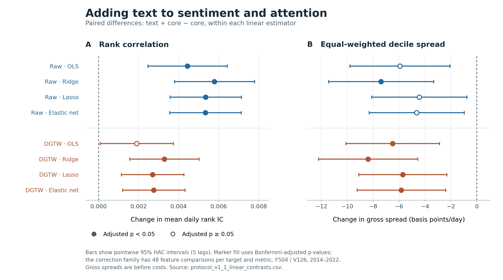

# Protocol v1.1: revised linear models

Generated from the saved evaluation artifacts. The tables use the complete supplied registry; model settings were selected on chronological validation data.

## Interpretation of the primary 504-session comparison

Reviewed against the saved paired contrasts on 2026-09-13. Statements about significance
below use the prespecified HAC5 and Bonferroni rules; they do not correct for the project's
entire prior research history.

- **Text adds ranking information.** Adding text to core raises mean daily IC by
  0.0053–0.0058 for the three regularized raw-return models and 0.0027–0.0033 for their
  DGTW counterparts. All six gains survive the primary adjustment; DGTW lasso is
  sensitive to the HAC choice (adjusted p = 0.059 at 63 lags), while ridge and elastic
  net remain significant at 21 and 63 lags. Adding text to the 53 social
  features improves IC in all eight estimator/target comparisons, with adjusted p < 0.001.
- **The 53 social features alone do not improve on core.** Their IC differences are
  negative for every primary estimator/target combination. None of the raw-return
  differences survives adjustment; the DGTW declines for OLS, lasso and elastic net do.
  This finding concerns the current engineered social features, not stock characteristics.
- **Ranking gains and portfolio gains differ.** Text + core has lower equal-weighted
  spreads than core for every estimator. Declines range from 4.45 to 7.40 bp/day for raw
  returns and 5.72 to 8.40 bp/day for DGTW; the raw ridge decline and all four DGTW declines
  survive adjustment. Isolated text additions do not produce adjusted-significant
  capitalization-weighted gains. Some bundled text + all social versus core comparisons
  do: for example, raw elastic net gains 6.97 bp/day (adjusted p = 0.024). These are gross
  descriptive sorts with the execution and source-timing limitations stated below.
- **Retain the registered benchmarks and window.** Regularization helps in some matched
  comparisons, especially ridge with text + all social, but does not uniformly beat OLS
  after adjustment. For text + core, extending fitting history from 504 to 756 sessions
  improves OLS significantly on both targets; the smaller gains for the three regularized
  models do not survive adjustment. The primary window remains 504 sessions. NN3 will be
  compared with all four linear estimators on matching inputs and dates.

Figure: matched text + core minus core comparisons. Bars are pointwise 95% HAC5 intervals;
filled markers pass the registered Bonferroni threshold. The DGTW-lasso sensitivity noted
above remains relevant. [Vector figure](figures/protocol_v1_1_linear_textcore_f504.svg);
[reproduction script](../tools/plot_protocol_linear.py).

## Design and coverage

The signal at close t summarizes messages assigned to that close; the main outcome is the return from close t to close t+1. Models refit monthly; this registry contains fitting histories of 252, 504, 756 sessions, with a fixed 126-session validation block. F504 is the primary history. Horizon-specific maturity rules separate fitting, validation, and testing. The selected fitting-block model is retained without refitting on validation.

Scalar features use centered daily midranks; embeddings and agreement measures remain unranked. Fitting-only scaling and equal-date squared loss on centered return ranks are shared across estimators. Validation uses mean daily Spearman IC. Feature availability determines prediction eligibility before future outcome availability is considered.

| Target | Models | Eligible stock-days | Common predictions | Observed outcomes | IC dates/model |
| --- | --- | --- | --- | --- | --- |
| Raw | 48 | 3,034,035 | 3,034,035 | 3,033,080 | 2,266–2,266 |
| DGTW | 48 | 3,034,035 | 3,034,035 | 2,748,978 | 2,266–2,266 |

Evaluation period: 2014-01-01 through 2022-12-31. Feature counts, including declared missingness flags: Core: 2, All social: 53, Text + core: 388, Text + all social: 439. All models within each target share one joint prediction-coverage intersection. Missing outcomes remain unscored; raw and DGTW samples can differ.

Core is net sentiment plus attention (`log_volume`). `all` denotes the current 53 engineered social-media features, including core; these are not stock characteristics or return-history controls. The text addition comprises 384 embedding coordinates plus two agreement measures. Text + core therefore has 388 inputs, and text + all social has 439 inputs before any additional missingness flags.

### Timing repair and result provenance

The corrected immutable cache excludes the invalid one-day raw and DGTW labels for FTNW (PERMNO 17182), signal 2019-03-13; its next observed stock row was 2019-03-26, after 8 missing exchange sessions. The prediction row and its features remain present. Daily target ranks were recomputed after the exclusion. Additional cumulative-horizon labels whose nominal intervals cross the identified gap were excluded from diagnostics. The older uncorrected full run is retained solely as a provenance/reuse source and is not the current result.

After repair, the 2014–2022 input universe contains 3,034,035 stock-days: 3,033,080 observed raw one-day labels and 955 missing raw labels. All 3,033,080 observed raw labels in this period reconcile with the next exchange-session return. Finite labels at the end of the broader source calendar remain explicitly unverified and fall outside this main period.

Repair details and per-horizon exclusions: [horizon_repair_audit.json](<../.runs/protocol_v1_1/prepared/8f3f4eb44b399771/horizon_repair_audit.json>).

Checkpoint migration verified unchanged inputs and fitting/validation dependencies before reusing 468 unaffected month-target checkpoints; 180 affected checkpoints required retraining. Audit: [migration_audit.json](<../.runs/protocol_v1_1/linear/full_3314fb5ca2fe170a/migration_audit.json>).

## Primary F504 rank IC

Rank IC is the equally weighted mean of daily Spearman correlations. These rank predictions are not return forecasts in percent; no return-unit R² is calculated.

### Raw

| Estimator | Core | All social | Text + core | Text + all social |
| --- | --- | --- | --- | --- |
| OLS | 0.0348 | 0.0328 | 0.0392 | 0.0390 |
| Ridge | 0.0346 | 0.0345 | 0.0404 | 0.0414 |
| Lasso | 0.0350 | 0.0334 | 0.0403 | 0.0401 |
| Elastic net | 0.0350 | 0.0335 | 0.0403 | 0.0400 |

### DGTW

| Estimator | Core | All social | Text + core | Text + all social |
| --- | --- | --- | --- | --- |
| OLS | 0.0330 | 0.0296 | 0.0349 | 0.0341 |
| Ridge | 0.0330 | 0.0317 | 0.0363 | 0.0372 |
| Lasso | 0.0336 | 0.0307 | 0.0363 | 0.0357 |
| Elastic net | 0.0336 | 0.0308 | 0.0363 | 0.0357 |

## Paired feature additions at F504

The following comparisons hold the estimator and fitting history fixed. Differences are model minus benchmark; intervals are pointwise 95% intervals. Adjusted p-values use the saved Bonferroni family, separately by target, metric, and period.

### Text + core minus core

| Target | Estimator | Δ IC | 95% CI | HAC t | Adjusted p |
| --- | --- | --- | --- | --- | --- |
| Raw | OLS | 0.0044 | [0.0025, 0.0064] | 4.40 | <0.001 |
| Raw | Ridge | 0.0058 | [0.0038, 0.0078] | 5.67 | <0.001 |
| Raw | Lasso | 0.0053 | [0.0036, 0.0071] | 5.88 | <0.001 |
| Raw | Elastic net | 0.0053 | [0.0036, 0.0071] | 5.86 | <0.001 |
| DGTW | OLS | 0.0019 | [0.0001, 0.0037] | 2.04 | 1.000 |
| DGTW | Ridge | 0.0033 | [0.0016, 0.0050] | 3.71 | 0.010 |
| DGTW | Lasso | 0.0027 | [0.0011, 0.0043] | 3.38 | 0.034 |
| DGTW | Elastic net | 0.0028 | [0.0012, 0.0043] | 3.46 | 0.026 |

### Text + all social minus all social

| Target | Estimator | Δ IC | 95% CI | HAC t | Adjusted p |
| --- | --- | --- | --- | --- | --- |
| Raw | OLS | 0.0061 | [0.0043, 0.0080] | 6.64 | <0.001 |
| Raw | Ridge | 0.0069 | [0.0052, 0.0086] | 7.92 | <0.001 |
| Raw | Lasso | 0.0067 | [0.0048, 0.0085] | 6.98 | <0.001 |
| Raw | Elastic net | 0.0066 | [0.0047, 0.0085] | 6.94 | <0.001 |
| DGTW | OLS | 0.0045 | [0.0028, 0.0062] | 5.27 | <0.001 |
| DGTW | Ridge | 0.0055 | [0.0041, 0.0068] | 7.82 | <0.001 |
| DGTW | Lasso | 0.0050 | [0.0034, 0.0065] | 6.36 | <0.001 |
| DGTW | Elastic net | 0.0050 | [0.0034, 0.0065] | 6.34 | <0.001 |

For text + core versus core, 7 of 8 available target/estimator contrasts are positive with adjusted p < 0.05; 0 are negative with adjusted p < 0.05. This counts the stated comparisons and does not select a new benchmark.

For text + all social versus all social, 8 of 8 available target/estimator contrasts are positive with adjusted p < 0.05; 0 are negative with adjusted p < 0.05. This counts the stated comparisons and does not select a new benchmark.

Family sizes in the saved evaluation:

| Target | Family | Comparisons |
| --- | --- | --- |
| Raw | estimator | 36 |
| Raw | feature | 48 |
| Raw | history | 32 |
| DGTW | estimator | 36 |
| DGTW | feature | 48 |
| DGTW | history | 32 |

The feature family includes all noncore inputs versus core and text + all social versus all social. The experiment specification documents the pre-result clarification of this family. The complete contrast file also includes all social versus core and text + all social versus core, together with HAC21/HAC63 sensitivities.

## Estimator changes with fixed inputs

Every non-OLS estimator is compared with OLS using the same inputs, dates, targets, and fitting history. These comparisons do not select the best model using test performance.

| Target | Estimator | Inputs | Δ IC | 95% CI | HAC t | Adjusted p |
| --- | --- | --- | --- | --- | --- | --- |
| Raw | Ridge | Core | -0.0001 | [-0.0003, 0.0001] | -1.04 | 1.000 |
| Raw | Lasso | Core | 0.0002 | [-0.0002, 0.0006] | 1.05 | 1.000 |
| Raw | Elastic net | Core | 0.0002 | [-0.0002, 0.0006] | 1.07 | 1.000 |
| Raw | Ridge | All social | 0.0017 | [0.0006, 0.0028] | 3.00 | 0.097 |
| Raw | Lasso | All social | 0.0006 | [-0.0003, 0.0014] | 1.28 | 1.000 |
| Raw | Elastic net | All social | 0.0006 | [-0.0002, 0.0015] | 1.42 | 1.000 |
| Raw | Ridge | Text + core | 0.0012 | [0.0002, 0.0022] | 2.43 | 0.550 |
| Raw | Lasso | Text + core | 0.0011 | [0.0003, 0.0020] | 2.68 | 0.266 |
| Raw | Elastic net | Text + core | 0.0011 | [0.0003, 0.0020] | 2.65 | 0.286 |
| Raw | Ridge | Text + all social | 0.0025 | [0.0011, 0.0038] | 3.50 | 0.017 |
| Raw | Lasso | Text + all social | 0.0011 | [0.0003, 0.0019] | 2.57 | 0.361 |
| Raw | Elastic net | Text + all social | 0.0011 | [0.0003, 0.0019] | 2.60 | 0.337 |
| DGTW | Ridge | Core | 0.0000 | [-0.0002, 0.0003] | 0.24 | 1.000 |
| DGTW | Lasso | Core | 0.0006 | [0.0003, 0.0009] | 4.20 | <0.001 |
| DGTW | Elastic net | Core | 0.0006 | [0.0003, 0.0009] | 4.20 | <0.001 |
| DGTW | Ridge | All social | 0.0021 | [0.0010, 0.0032] | 3.79 | 0.005 |
| DGTW | Lasso | All social | 0.0011 | [0.0002, 0.0021] | 2.38 | 0.630 |
| DGTW | Elastic net | All social | 0.0011 | [0.0002, 0.0021] | 2.40 | 0.597 |
| DGTW | Ridge | Text + core | 0.0014 | [0.0006, 0.0023] | 3.29 | 0.036 |
| DGTW | Lasso | Text + core | 0.0014 | [0.0004, 0.0023] | 2.89 | 0.137 |
| DGTW | Elastic net | Text + core | 0.0014 | [0.0005, 0.0024] | 3.06 | 0.080 |
| DGTW | Ridge | Text + all social | 0.0030 | [0.0017, 0.0044] | 4.38 | <0.001 |
| DGTW | Lasso | Text + all social | 0.0016 | [0.0005, 0.0027] | 2.78 | 0.197 |
| DGTW | Elastic net | Text + all social | 0.0016 | [0.0005, 0.0027] | 2.77 | 0.200 |

## Fitting-history sensitivity

Validation remains fixed at 126 sessions. The table shows text + core IC for all registered histories; the paired changes compare F252/F756 with F504 on the same evaluation sample.

| Target | Estimator | 252 | 504 | 756 |
| --- | --- | --- | --- | --- |
| Raw | OLS | 0.0379 | 0.0392 | 0.0405 |
| Raw | Ridge | 0.0399 | 0.0404 | 0.0406 |
| Raw | Lasso | 0.0399 | 0.0403 | 0.0405 |
| Raw | Elastic net | 0.0399 | 0.0403 | 0.0405 |
| DGTW | OLS | 0.0339 | 0.0349 | 0.0363 |
| DGTW | Ridge | 0.0356 | 0.0363 | 0.0365 |
| DGTW | Lasso | 0.0358 | 0.0363 | 0.0368 |
| DGTW | Elastic net | 0.0358 | 0.0363 | 0.0368 |

| Target | Estimator | Fit dates | Δ IC | 95% CI | HAC t | Adjusted p |
| --- | --- | --- | --- | --- | --- | --- |
| Raw | OLS | 252 | -0.0013 | [-0.0023, -0.0003] | -2.60 | 0.298 |
| Raw | Ridge | 252 | -0.0005 | [-0.0015, 0.0004] | -1.13 | 1.000 |
| Raw | Lasso | 252 | -0.0005 | [-0.0015, 0.0005] | -0.95 | 1.000 |
| Raw | Elastic net | 252 | -0.0005 | [-0.0014, 0.0005] | -0.91 | 1.000 |
| Raw | OLS | 756 | 0.0013 | [0.0006, 0.0020] | 3.45 | 0.018 |
| Raw | Ridge | 756 | 0.0002 | [-0.0007, 0.0010] | 0.40 | 1.000 |
| Raw | Lasso | 756 | 0.0001 | [-0.0006, 0.0009] | 0.30 | 1.000 |
| Raw | Elastic net | 756 | 0.0001 | [-0.0006, 0.0009] | 0.35 | 1.000 |
| DGTW | OLS | 252 | -0.0010 | [-0.0020, 0.0000] | -2.01 | 1.000 |
| DGTW | Ridge | 252 | -0.0007 | [-0.0016, 0.0003] | -1.37 | 1.000 |
| DGTW | Lasso | 252 | -0.0004 | [-0.0015, 0.0006] | -0.86 | 1.000 |
| DGTW | Elastic net | 252 | -0.0005 | [-0.0015, 0.0005] | -0.97 | 1.000 |
| DGTW | OLS | 756 | 0.0014 | [0.0006, 0.0022] | 3.38 | 0.024 |
| DGTW | Ridge | 756 | 0.0002 | [-0.0005, 0.0010] | 0.65 | 1.000 |
| DGTW | Lasso | 756 | 0.0006 | [-0.0003, 0.0014] | 1.30 | 1.000 |
| DGTW | Elastic net | 756 | 0.0005 | [-0.0003, 0.0013] | 1.21 | 1.000 |

## Gross portfolio diagnostics

Values are average daily top-minus-bottom decile returns in basis points. Equal-weighted and capitalization-weighted sorts require at least ten fractional security memberships per decile. Ties share their rank intervals; constant forecasts hold cash. Capitalization comes from `cap`. These are descriptive gross sorts, with no claim of attainable same-close execution, turnover-adjusted profitability, costs, or factor alpha.

### Equal-weighted

| Target | Estimator | Core | All social | Text + core | Text + all social |
| --- | --- | --- | --- | --- | --- |
| Raw | OLS | 26.98 | 27.45 | 21.05 | 26.58 |
| Raw | Ridge | 27.42 | 25.90 | 20.02 | 26.96 |
| Raw | Lasso | 27.79 | 25.88 | 23.34 | 27.46 |
| Raw | Elastic net | 27.79 | 26.07 | 23.14 | 27.31 |
| DGTW | OLS | 23.54 | 23.06 | 17.04 | 22.47 |
| DGTW | Ridge | 24.99 | 22.41 | 16.59 | 22.73 |
| DGTW | Lasso | 25.33 | 22.44 | 19.61 | 23.05 |
| DGTW | Elastic net | 25.31 | 22.69 | 19.48 | 23.15 |

### Capitalization-weighted

| Target | Estimator | Core | All social | Text + core | Text + all social |
| --- | --- | --- | --- | --- | --- |
| Raw | OLS | -2.12 | -1.06 | 3.25 | 5.39 |
| Raw | Ridge | -2.21 | -0.84 | 1.96 | 3.86 |
| Raw | Lasso | -2.40 | -1.17 | 3.23 | 4.50 |
| Raw | Elastic net | -2.40 | -1.08 | 3.13 | 4.57 |
| DGTW | OLS | -1.33 | 1.61 | 2.13 | 4.04 |
| DGTW | Ridge | -0.77 | 0.14 | 0.73 | 2.20 |
| DGTW | Lasso | -1.21 | 0.67 | 1.66 | 2.45 |
| DGTW | Elastic net | -1.21 | 0.73 | 1.86 | 2.50 |

The decile artifact includes raw and date-demeaned legs separately. Demeaning uses the unweighted eligible-stock mean within that scope and day; cash remains zero. Paired spread confidence intervals and adjusted p-values are in the contrast artifact, rather than inferred from differences between individual-model t-statistics.

## Stability and composition

The compact tables below use text + core at F504 without selecting it based on test results. All registered models' yearly and subperiod comparisons remain in the linked artifacts.

| Target | Estimator | full | 2014-2018 | 2019-2022 |
| --- | --- | --- | --- | --- |
| Raw | OLS | 0.0392 | 0.0331 | 0.0468 |
| Raw | Ridge | 0.0404 | 0.0345 | 0.0479 |
| Raw | Lasso | 0.0403 | 0.0342 | 0.0480 |
| Raw | Elastic net | 0.0403 | 0.0342 | 0.0480 |
| DGTW | OLS | 0.0349 | 0.0294 | 0.0417 |
| DGTW | Ridge | 0.0363 | 0.0310 | 0.0430 |
| DGTW | Lasso | 0.0363 | 0.0312 | 0.0426 |
| DGTW | Elastic net | 0.0363 | 0.0313 | 0.0427 |

### Yearly text + core IC: Raw

| Year | OLS | Ridge | Lasso | Elastic net |
| --- | --- | --- | --- | --- |
| 2014 | 0.0208 | 0.0255 | 0.0232 | 0.0232 |
| 2015 | 0.0277 | 0.0286 | 0.0286 | 0.0285 |
| 2016 | 0.0362 | 0.0376 | 0.0379 | 0.0379 |
| 2017 | 0.0394 | 0.0382 | 0.0397 | 0.0397 |
| 2018 | 0.0417 | 0.0425 | 0.0418 | 0.0418 |
| 2019 | 0.0437 | 0.0444 | 0.0438 | 0.0437 |
| 2020 | 0.0458 | 0.0466 | 0.0466 | 0.0466 |
| 2021 | 0.0479 | 0.0487 | 0.0498 | 0.0498 |
| 2022 | 0.0499 | 0.0519 | 0.0516 | 0.0516 |

### Yearly text + core IC: DGTW

| Year | OLS | Ridge | Lasso | Elastic net |
| --- | --- | --- | --- | --- |
| 2014 | 0.0181 | 0.0237 | 0.0190 | 0.0195 |
| 2015 | 0.0219 | 0.0214 | 0.0240 | 0.0239 |
| 2016 | 0.0347 | 0.0377 | 0.0389 | 0.0389 |
| 2017 | 0.0344 | 0.0334 | 0.0354 | 0.0354 |
| 2018 | 0.0380 | 0.0386 | 0.0387 | 0.0387 |
| 2019 | 0.0373 | 0.0380 | 0.0380 | 0.0380 |
| 2020 | 0.0464 | 0.0474 | 0.0472 | 0.0472 |
| 2021 | 0.0465 | 0.0480 | 0.0477 | 0.0478 |
| 2022 | 0.0366 | 0.0384 | 0.0377 | 0.0377 |

### Size and activity gradients

| Target | Estimator | activity_tercile_1 | activity_tercile_2 | activity_tercile_3 | size_tercile_1 | size_tercile_2 | size_tercile_3 |
| --- | --- | --- | --- | --- | --- | --- | --- |
| Raw | OLS | 0.0079 | 0.0195 | 0.0626 | 0.0515 | 0.0174 | 0.0081 |
| Raw | Ridge | 0.0107 | 0.0205 | 0.0613 | 0.0515 | 0.0176 | 0.0085 |
| Raw | Lasso | 0.0107 | 0.0191 | 0.0612 | 0.0537 | 0.0190 | 0.0086 |
| Raw | Elastic net | 0.0108 | 0.0191 | 0.0611 | 0.0537 | 0.0190 | 0.0086 |
| DGTW | OLS | 0.0063 | 0.0156 | 0.0576 | 0.0471 | 0.0146 | 0.0065 |
| DGTW | Ridge | 0.0091 | 0.0171 | 0.0559 | 0.0473 | 0.0153 | 0.0068 |
| DGTW | Lasso | 0.0089 | 0.0157 | 0.0570 | 0.0504 | 0.0157 | 0.0076 |
| DGTW | Elastic net | 0.0088 | 0.0159 | 0.0571 | 0.0505 | 0.0158 | 0.0077 |

Tercile 1 is low and tercile 3 is high. Groups use contemporaneous midranks before outcome filtering; identical values remain together. These subgroup means describe composition and do not establish a causal mechanism.

### Cumulative-horizon diagnostics

| Target | Estimator | 3 | 5 | 10 | 21 | 42 | 63 |
| --- | --- | --- | --- | --- | --- | --- | --- |
| Raw | OLS | 0.0486 | 0.0554 | 0.0651 | 0.0789 | 0.0954 | 0.1085 |
| Raw | Ridge | 0.0508 | 0.0572 | 0.0672 | 0.0823 | 0.0995 | 0.1147 |
| Raw | Lasso | 0.0502 | 0.0569 | 0.0669 | 0.0821 | 0.0990 | 0.1131 |
| Raw | Elastic net | 0.0502 | 0.0569 | 0.0669 | 0.0820 | 0.0990 | 0.1131 |
| DGTW | OLS | 0.0424 | 0.0479 | 0.0573 | — | 0.0840 | 0.0942 |
| DGTW | Ridge | 0.0444 | 0.0497 | 0.0590 | — | 0.0878 | 0.0991 |
| DGTW | Lasso | 0.0439 | 0.0494 | 0.0588 | — | 0.0875 | 0.0987 |
| DGTW | Elastic net | 0.0440 | 0.0495 | 0.0590 | — | 0.0875 | 0.0987 |

The h=1-trained forecasts are evaluated against cumulative close-t-to-close-(t+h) returns. These are not models trained for each horizon or disjoint future return intervals; persistent cumulative IC does not show when a return accrues. DGTW h=21 is excluded because of the known source-data corruption. Longer-horizon summaries use at least h−1 HAC lags.

## Numerical diagnostics

| Estimator | Selected monthly fits | Max KKT residual | Max dual gap | Initial CD limit hits |
| --- | --- | --- | --- | --- |
| OLS | 2592 | 1.72e-16 | — | 0 |
| Ridge | 2592 | 1.66e-16 | — | 0 |
| Lasso | 2592 | 2.38e-16 | 6.25e-17 | 5 |
| Elastic net | 2592 | 4.89e-17 | 1.39e-17 | 528 |

These statistics describe the validation-selected fits. Coordinate-descent limit hits refer to the initial solver; active-set refinement and final optimality checks determine acceptance. Complete candidate diagnostics remain in the monthly checkpoints.

Selection records: [monthly_selection.csv](<../.runs/protocol_v1_1/linear/full_3314fb5ca2fe170a/monthly_selection.csv>).

## Scope and limitations

This is historical development evidence in the tagged-message common-stock universe. Prior linear results and pilot periods were already inspected; the evaluation is not a newly untouched holdout. It does not establish social media's incremental information beyond stock characteristics, return history, or news, because those conditioning-information experiments remain separate.

The source routing assumes a nominal 16:00 close and does not repair early-close sessions. On those days some inputs can arrive after the actual close, so these results do not certify an executable forecast at that close. Label availability is assumed at the outcome's session endpoint; publication-delay metadata are unavailable. Longer-horizon imported labels have not received the same full certification as h=1. The source text panel has gaps across September-December 2023, including all October; these dates lie outside the main period.

Models share prediction and realized-outcome samples within each target family. Raw and DGTW results can use different realized-outcome samples, so differences across those two targets also reflect sample composition.

Multiplicity corrections cover the registered comparisons shown here, not the project's entire research history. Changing the fitting history changes only the designated historical fitting block; its interpretation should remain separate from input and estimator changes.

## Reproducibility and full artifacts

- [Main model statistics](<data/protocol_v1_1_linear.csv>)
- [Prediction and outcome coverage](<data/protocol_v1_1_linear_coverage.csv>)
- [All paired contrasts, intervals, adjusted p-values, and HAC sensitivities](<data/protocol_v1_1_linear_contrasts.csv>)
- [Calendar-aligned daily series](<data/protocol_v1_1_linear_daily.csv>)
- [Yearly statistics](<data/protocol_v1_1_linear_yearly.csv>)
- [Subperiod statistics](<data/protocol_v1_1_linear_periods.csv>)
- [Raw and demeaned decile profiles](<data/protocol_v1_1_linear_deciles.csv>)
- [Size and activity diagnostics](<data/protocol_v1_1_linear_subgroups.csv>)
- [Cumulative-horizon diagnostics](<data/protocol_v1_1_linear_horizons.csv>)

Registry: [registry.json](<../.runs/protocol_v1_1/linear/full_3314fb5ca2fe170a/registry.json>). Evaluation metadata: [protocol_v1_1_linear.json](<data/protocol_v1_1_linear.json>). Prepared data manifest: [manifest.json](<../.runs/protocol_v1_1/prepared/8f3f4eb44b399771/manifest.json>).

`mean` is mean rank IC or mean spread in bp as named by `metric`; `n` is the usable number of trading dates; paired `mean` is model minus benchmark. Standard errors preserve missing sessions' calendar distances. Inputs, predictions, configuration identifiers, and code hashes are recorded in the manifests. Prediction caches remain under `.runs`.
